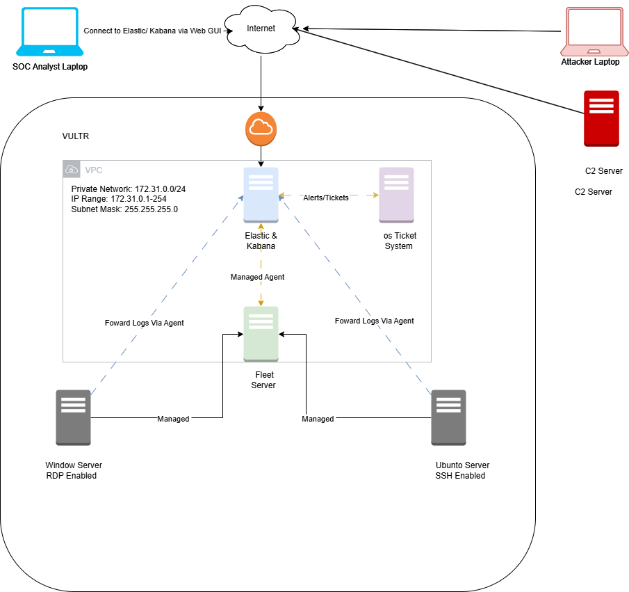
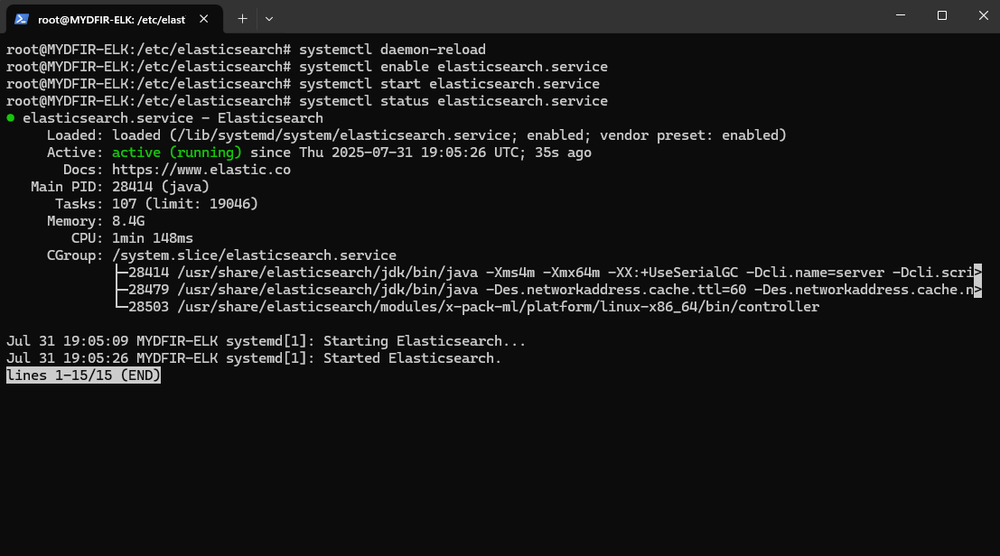
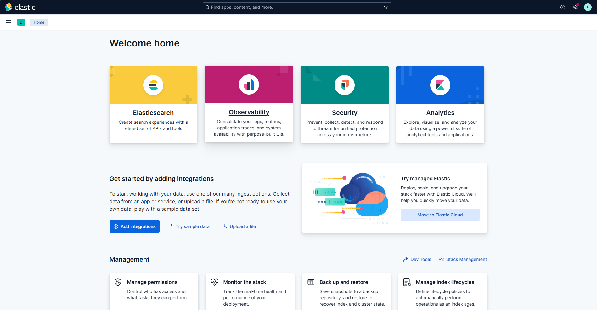
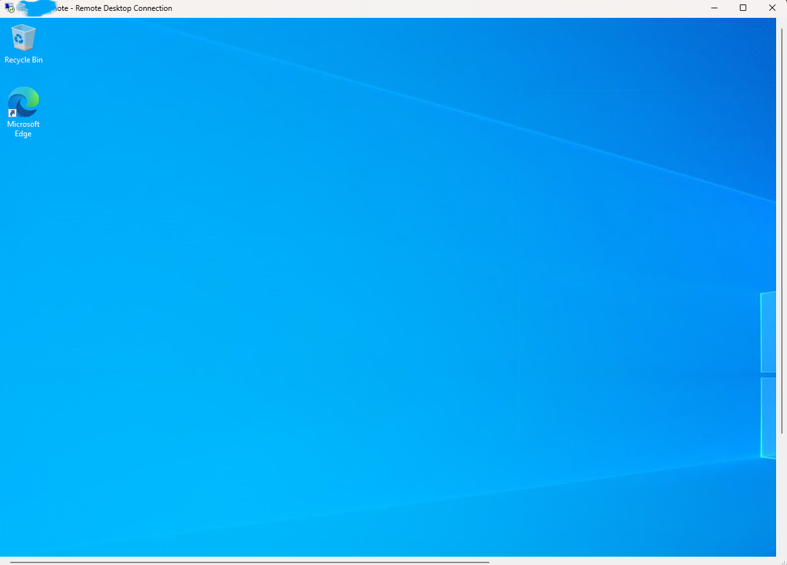
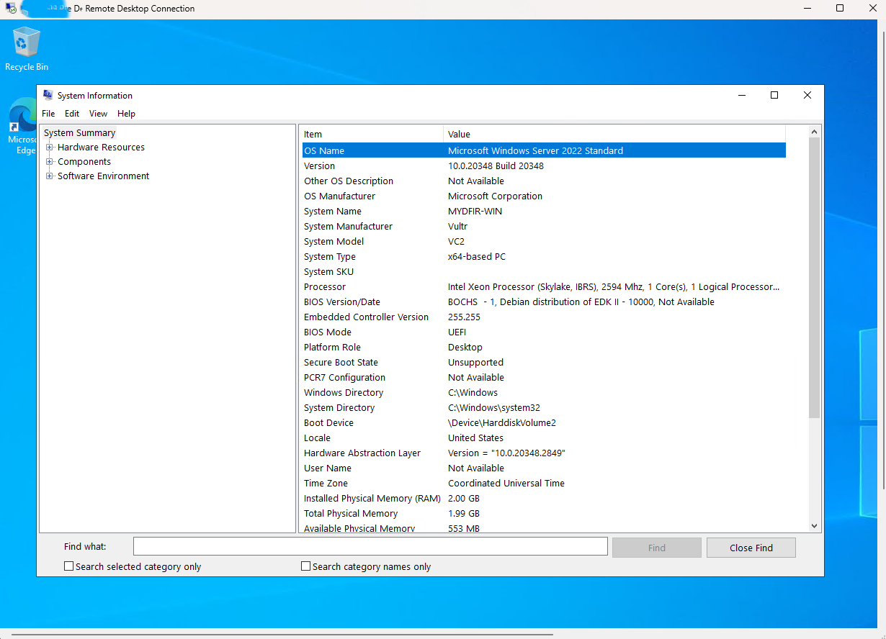
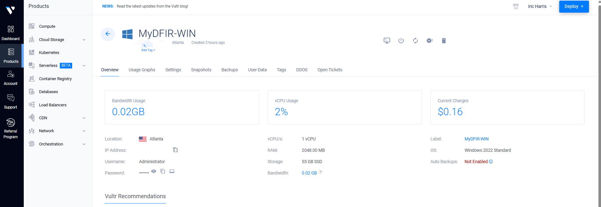

# 🧱 Week 1 – SOC Lab Setup (Vultr-Based)

This week focuses on designing and deploying a fully cloud-hosted SOC lab using the Elastic Stack and Windows Server 2022. All virtual machines were provisioned using **Vultr**, simulating a realistic enterprise-grade environment for log monitoring, collection, and analysis.

---

## 📅 Day 1 – Lab Planning & Architecture

🌟 **Goal:** Design and map out the architecture of a cloud-based SOC lab using Vultr as the hosting provider.

### ☁️ Lab Architecture Overview

| Host                | Purpose                        | Tool/OS                   |
|---------------------|--------------------------------|---------------------------|
| Ubuntu Server VM    | SIEM & dashboard               | Elasticsearch, Kibana     |
| Fleet Server        | Agent coordination & policies  | Elastic Fleet             |
| Windows Server VM   | Endpoint log source            | Windows Server 2022       |
| Analyst Workstation | SOC investigation hub          | Web browser (local)       |

📌 Lab diagram created using [draw.io](https://draw.io)

📸 Screenshot:  


---

## 📅 Day 2 – ELK Stack Setup (Ubuntu on Vultr)

🌟 **Goal:** Set up Elasticsearch and Kibana on a cloud-hosted Ubuntu server.

### 🛠️ Installation Steps

```bash
sudo apt update && sudo apt upgrade -y
sudo apt install elasticsearch kibana -y
sudo systemctl enable elasticsearch --now
sudo systemctl enable kibana --now
```

### 🥺 Validation
- Accessed Kibana UI in the browser via public IP on port `5601`
- Verified that Elasticsearch service was active and running

📸 Screenshots:
- 
- 

✅ Both services are successfully installed and accessible.

---

## 📅 Day 3 – Windows Server 2022 Deployment (Vultr)

🌟 **Goal:** Deploy a Windows Server instance to simulate a log-generating endpoint in the SOC lab.

### 🛠️ Steps Taken:

1. Launched a Windows Server 2022 instance via **Vultr dashboard**
2. Selected the appropriate size and datacenter region
3. Configured:
   - Hostname
   - Administrator password
   - Public IP address for Remote Desktop
4. Connected to the instance via **Remote Desktop (RDP)**
5. Applied Windows updates and confirmed outbound internet access
6. Enabled necessary ports in Vultr’s firewall rules (RDP, agent traffic)

📸 Screenshots:
- 
- 
- 

✅ Windows Server is successfully deployed and ready for Elastic Agent installation and Fleet enrollment.

